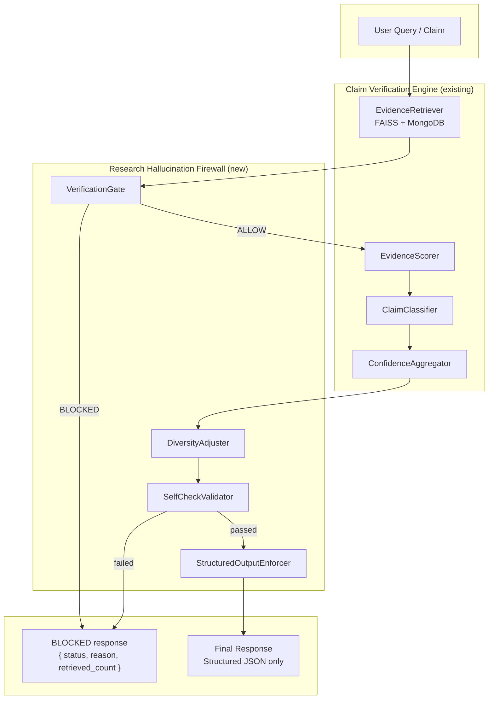

# Research Hallucination Firewall — Architecture

**Goal:** Prevent unsupported generation; ensure every output is verifiable; force credibility before response.  
**Principle:** Extend the existing Claim Verification Engine; do not replace or remove functionality.

---

## Flow Diagram (ASCII)

```
                    User Query / Claim
                            |
                            v
                 +----------------------+
                 |   EvidenceRetriever  |  (FAISS + MongoDB)
                 +----------------------+
                            |
                            v
                 +----------------------+
                 |   VerificationGate   |  --> BLOCKED? --> { status, reason, retrieved_count }
                 +----------------------+
                            | ALLOW
                            v
                 +----------------------+
                 | EvidenceScorer       |
                 | ClaimClassifier      |
                 +----------------------+
                            |
                            v
                 +----------------------+
                 | ConfidenceAggregator |
                 +----------------------+
                            |
                            v
                 +----------------------+
                 |  DiversityAdjuster   |  (cross-source, contradiction override)
                 +----------------------+
                            |
                            v
                 +----------------------+
                 |  SelfCheckValidator  |  --> failed? --> BLOCKED
                 +----------------------+
                            | passed
                            v
                 +----------------------+
                 | StructuredOutputEnforcer |  (JSON-only, no free text)
                 +----------------------+
                            |
                            v
                    Final Response (structured JSON)
```

---

## Flow Diagram (Mermaid)



### Sequence (high level)

1. **User Query** → EvidenceRetriever returns top-k chunks (similarity + metadata).
2. **VerificationGate** checks:
   - `retrieved_count == 0` → **BLOCKED**
   - `retrieved_count < MIN_EVIDENCE_COUNT` → **BLOCKED**
   - `avg(similarity_score) < MIN_AVG_SIMILARITY` → **BLOCKED**
   - After scoring: `total_evidence_weight < MIN_TOTAL_EVIDENCE_WEIGHT` → **BLOCKED**
3. **EvidenceScorer + ClaimClassifier** (existing) → scored evidence.
4. **ConfidenceAggregator** (existing) → VerificationResult.
5. **DiversityAdjuster** (new): same publisher/journal or &lt; 2 distinct sources → lower confidence; contradiction weight &gt; support → CONTRADICTED.
6. **SelfCheckValidator** (new): deterministic + optional LLM check (support_count vs evidence_summary; DOIs; consistency). If failed → **BLOCKED**.
7. **StructuredOutputEnforcer** (new): output is JSON-only schema; no free-form LLM paragraphs.
8. **Final Response** = structured dict with `claim`, `support_count`, `contradict_count`, `confidence_score`, `confidence_label`, `evidence_summary`, `verification_status`.

---

## Component Summary

| Component | Role |
|-----------|------|
| **VerificationGate** | No generation without retrieval; block on 0 results, low count, low similarity/weight. |
| **DiversityAdjuster** | Cross-source validation; penalize single source; override CONTRADICTED when contradict &gt; support. |
| **SelfCheckValidator** | Second-pass check (deterministic + LLM): DOIs, support_count vs evidence_summary, consistency. |
| **StructuredOutputEnforcer** | Enforce JSON-only response; validate schema; prevent hallucinated citations. |
| **FirewallMetrics** | Block rate, evidence sufficiency rate, self-check failure rate; rejected-query log; evaluation helpers. |

---

## Blocked Response (structured JSON)

When the firewall blocks generation:

```json
{
  "status": "BLOCKED",
  "reason": "Insufficient evidence",
  "retrieved_count": 2,
  "avg_similarity": 0.42,
  "total_evidence_weight": null
}
```

---

## Final Response (structured JSON, no free text)

```json
{
  "claim": "...",
  "support_count": 5,
  "contradict_count": 1,
  "confidence_score": 0.74,
  "confidence_label": "Moderate",
  "evidence_summary": [
    { "paper_id": "...", "label": "SUPPORT", "evidence_score": 0.82, "doi": null }
  ],
  "verification_status": "VERIFIED",
  "evidence_count": 6,
  "evidence_strength": "Strong (2 meta-analyses, 3 RCTs)",
  "strongest_study_types": ["meta_analysis", "rct"],
  "guardrail_triggered": null,
  "scored_evidence": [ ... ]
}
```

---

## Configurable Thresholds (Part 2)

| Constant | Default | Meaning |
|----------|---------|---------|
| `MIN_EVIDENCE_COUNT` | 3 | Minimum number of retrieved chunks to allow generation. |
| `MIN_AVG_SIMILARITY` | 0.45 | Minimum average similarity score over retrieved chunks. |
| `MIN_TOTAL_EVIDENCE_WEIGHT` | 1.5 | Minimum sum of evidence_score after scoring. |
| `MIN_DISTINCT_SOURCES_FOR_FULL_CONFIDENCE` | 2 | Below this, confidence is downgraded. |
| `FIREWALL_DIVERSITY_PENALTY` | 0.15 | Subtracted from confidence when diversity is low. |

---

## Logging & Monitoring (Part 7)

- **Blocked responses:** `FirewallMetrics.record_blocked(reason)`; `log_rejected_query(claim, reason, ...)`.
- **Contradiction-heavy:** `record_contradiction_heavy(result)` when label is Contradicted.
- **Low diversity:** `record_low_diversity(result, scored_evidence)` when distinct sources &lt; 2.
- **Metrics:** `block_rate`, `evidence_sufficiency_rate`, `self_check_failure_rate`; `snapshot()` for dashboards.
- **Evaluation:** `evaluation_hallucination_reduction(...)`, `evaluation_false_positive_verification(...)`, `evaluation_confidence_calibration(...)`.

---

## Usage

**Existing API (unchanged):** still uses `VerificationEngine.verify()` for `/verify/claim`.

**Firewall pipeline (optional):**

```python
from app.verification.firewall import FirewallVerificationPipeline

pipeline = FirewallVerificationPipeline(
    top_k=10,
    workspace_id=ws_id,
    user_id=user_id,
    use_self_check_llm=True,
)
result = pipeline.verify_through_firewall(claim="...", paper_ids=None)
if result.get("status") == "BLOCKED":
    # handle blocked
else:
    # result is structured dict with claim, support_count, evidence_summary, etc.
    pass
metrics = pipeline.metrics.snapshot()
```

---

## File Layout

```
backend/app/verification/
  constants.py          # + MIN_AVG_SIMILARITY, MIN_TOTAL_EVIDENCE_WEIGHT, ...
  schemas.py            # + VerificationStatus, GateResult, EvidenceSummaryItem, SelfCheckResult
  firewall/
    __init__.py
    gate.py             # VerificationGate
    structured_output.py # StructuredOutputEnforcer
    self_check.py       # SelfCheckValidator
    diversity.py        # DiversityAdjuster, adjust_confidence_for_diversity()
    pipeline.py         # FirewallVerificationPipeline
    metrics.py          # FirewallMetrics
docs/
  RESEARCH_HALLUCINATION_FIREWALL.md  # this file
```
